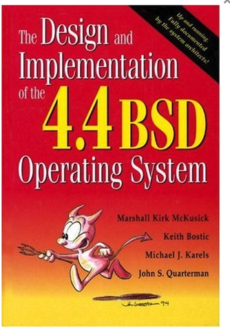

### Introduction

This was originally written for book report assignment of the [CMU's OS class](https://www.cs.cmu.edu/~410/).  I did not manage to finish the entire book during the semester (of course I did not lol.) but cherry-picked some of the chapters. 

[Book Link](https://www.goodreads.com/book/show/5767.The_Design_and_Implementation_of_the_4_4_BSD_Operating_System)

### Question 1: Educational value of material

>  What was the most surprising, interesting, or eye-opening material you found in what you read? If you want, you can fall back to summarizing everything you read, but I'd rather you focused on what was the most valuable to you?

While doing our P3, I was curious how FreeBSD implements synchronization in the kernel. The section on "Context Switch" covers some really cool design and data structures. The most interesting being the "turnstile". 

I knew that a kernel thread might block for different reasons, but then came to realize that a thread will also block for a different period of time depending on the reason: a long wait might happen if a thread is waiting for an event that could only happen at an indeterminate time in the future, such as user input; a medium wait would happen if the event it is waiting on might not happen immediately but not too far in the future, such as reading from disk; and a short wait happens when a lock request is not granted (in fact, this is the only case a short wait happens in FreeBSD). 

The turnstile is what FreeBSD uses to manage a short-term lock. Each turnstile keeps track of:

1. the owner of the lock (pointer to thread's TCB)
2. pointer to the lock 
3. a list of waiters
4. pointer to other turnstiles. 

One less intuitive design regarding the turnstile is its ownership. A turnstile is owned by a thread, rather than a lock because there are way more locks than a thread in the kernel. A turnstile will be allocated at thread's creation, and passed along between different threads during execution: when a thread gets blocked on a lock, it will add itself to the waiters of the turnstile if there is already a turnstile, and add its turnstile to a free list. If it is the first thread getting blocked, it will give out its turnstile. When a thread is unblocked, it will take a turnstile from the free list if it is not the last one. 

Another functionality that the turnstile made possible is priority propagation when a thread with higher priority trying to acquire a lock owned by a thread with lower priority (priority inversion). With the owner TCB, the higher priority thread could "lend" its priority to the low-priority thread running. When the low-priority lock owner thread unlocks, it could then return to its original priority. 

A related concept to turnstile is called "wait-channel", which is a pointer that represents a resource that a thread could wait on. Lock is a kind of wait channel, and the wait channel of a lock will be used as a key into a global turnstile hash table to derive the turnstile. 

### Question 2: Recommendation

> Would you recommend this material to your friends or co-workers? To which ones? Why? In the course of reading this, did you find out about some other material you would recommend? What, and why?

I would probably recommend this book to someone interested in knowing how a mature operating system is implemented, but not who wishes to learn operating system concepts. At first, I tried to use this book as a guide to teaching me how to write a kernel, wishing to find snippets or chapters that discuss some of the implementations in great detail, such as deadlock avoidance/prevention, process termination synchronization, kernel synchronization, etc. However, I soon realized that although the book covered such things, but not detailed enough as a "reference kernel teaching guide". After all, that might not be the most suitable usage of this book. 

But the chapters that cover security, filesystems, etc are great for anyone who wants to learn the relevant topics. Those topics, however, are not so easy to digest since the book does go into details. Overview for some of the topics like the Fast Filesystem, the Zettabyte Filesystem is not easy to understand, even though it should be a high-level discussion of the topic. 

### Question 3: Value of this assignment

> This assignment is probably somewhat unusual for CS courses. Do you think it was worth your time? Please feel free to recommend improvements in the format of the assignment

I think it is great that the course staff kind of forces us to do more reading! Fortunately, my partner and I pick the same book to read, and it was from our discussion that I felt I learned the most because I tried to internalize the content and discuss those topics I read with him. So I guess maybe more frequent discussion in the format of post/"chapter report" among partners or different groups would be a good exercise to add to the book report assignment. This will also "force" us to not do binge-reading in some ways. 